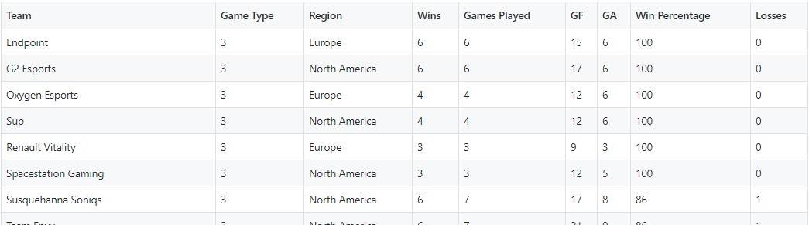

# Fusion Tournament

The objective of this project is to scrape both roster and game information for the Rocket League Fusion Qualifier Tournament and compile it into a more palatable format.

1. Scrape information from Liquipedia using `requests` and `BeatifulSoup` for the Europe and North American Regions.
2. Store scraped data in `rosters.csv` and `game_list.csv` in `./fusion_output`
3. Aggregate `game_list` df to get team stats. Output as `teams.csv`

These outputs (as well as additional stats) can also be found in this [Google sheet](https://docs.google.com/spreadsheets/d/1V8O4ABSkezSHgLwecJ5NeG7PLoibam_fNNSPQCScFIw/edit#gid=252665817).

The `teams` df will have the following output:

